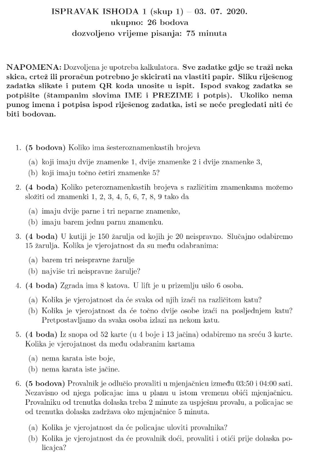
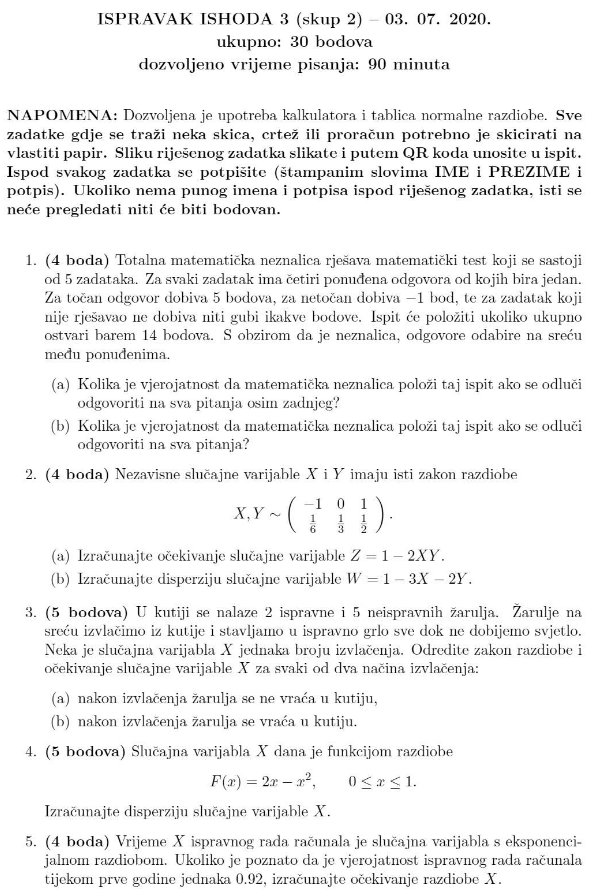
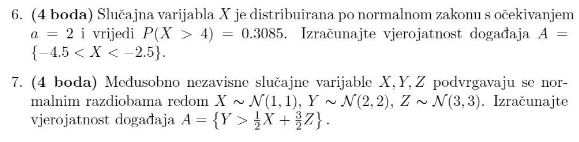
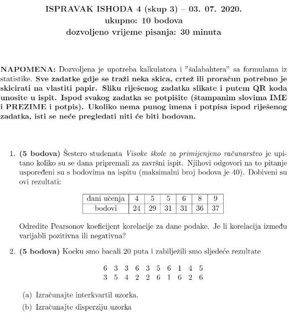

## Prvi i drugi rok

### I2
1. Tri strijelca gadaju metu po jedanput, nezavisno jedan od drugoga. Vjerojatnost pogotka 
prvog strijelca je 0.2 a drugog 0.3. Kolika je vjerojatnost pogotka treceg strijelca ako je poznato
da ce meta biti pogodena jednaka 0.664?

2. (3) Tri strijelca gadaju s vjerojatnoscu od 0.2, 0.4, 0.6. a) meta je pogodena, b) tocno je jedan 
pogodio metu, c) najvise je jedan pogodio metu

3. (3) A i B su nezavisni dogadaji, P(A) = 1/6, P(A∪B) = 3/5. Vjerojatnost dogadaja B?

4. (4) Bacamo 6 kocaka. A = { pale su 2 jedinice i 2 dvojke }, B = { svi brojevi su manji od 4 }. 
Odredi uvjetne vjerojatnosti P(A|B) i P(B|A)

5. (4) Student odgovara na pitanja. Ima 4 odgovora od kojih tri tocna i jedan netocan. Vjerojatnost
da zna odgovor je 0.8, a da ne zna odnosno pogada na srecu 0.2. a) vjerojatnost da tocno odgovori,
b) ako je tocno odgovorio kolika je vjerojatnost da odgovor nije pogodio na srecu?

### I3
1. (4) Strijelac pogada metu s vjerojatnoscu od 0.8 
a) vjerojatnost da ce u 8 pokusaja pogoditi tocno 4 puta,
b) vjerojatnost da ce u 8 pokusaja pogoditi barem 2 puta

2. (5) 

a) zakon razdiobe slucajne varijable Z = X - Y
b) disperzija slucajne varijable W = X - 2Y

3. (4) X je slucajna varijabla zadana funkcijom gustoce

izracunaj konstantu c te ocekivanje slucajne varijable X

4. (4) Elektromotor se tijekom 1 godine pokvario 5 puta. Kolika je vjerojatnost da ce se pokvariti tijekom treceg mejseca
iduce godine ako je poznato da se tijekom prva dva mjeseca nije pokvario?

5. (4) Slucajna varijabla x ima normalnu razdiobu sa ocekivanjem a = 2 i vrijedi P(x>4) = 0.3085. 
Izracunaj vjerojatnost dogadaja x, { -5 < x < -2 } 

6. (4) Vjerojatnost da u 16000 bacanja ispravnog novcica broj pisama bude manji od 8100

7. (5) X i Y su medusobno nezavisne slucajne varijable s normalnom razdiobom X ~ N(5,4), Y ~ N(4,9). 
Neka je Z = 2X + Y i W = X + 2Y. Izracunaj vjerojatnost dogadaja P(Z>W)

### I3

4)&space;=&space;0.3085&space;\newline&space;\indent&space;\text{a)&space;izracunaj&space;dispreziju&space;slucajne&space;varijable&space;X&space;}&space;\newline&space;\indent&space;\text{b)&space;izracunaj&space;vjerojatnost&space;dogadaja&space;}&space;A&space;=&space;\{&space;-4.5&space;<&space;X&space;<&space;-2.5&space;\}" title="\newline\text{4. (5) Slucajna varijabla X dana je funkcijom razdiobe: } \newline \indent F(X) = 2X-X^{2}, 0\leq X\leq 1 \newline \indent \text{Izracunaj disperziju slucajne varijable X} \newline \newline\text{5. (4) Vrijeme X ispravnog rada stroja je slucajna varijabla} \newline \indent \text{sa eksponencijalnom razdiobom. Ukoliko je poznato da } \newline \indent \text{je vjerojatnost ispravnog rada racunala tijekom jedne } \newline \indent \text{godine jednaka 0.92 izracunajte ocekivanje razdiobe X } \newline \newline\text{6. (5) Slucajna varijabla X distribuirana je po normalnom } \newline \indent \text{zakonu s ocekivanjem a = 2 i vrijedi } P(X>4) = 0.3085 \newline \indent \text{a) izracunaj dispreziju slucajne varijable X } \newline \indent \text{b) izracunaj vjerojatnost dogadaja } A = \{ -4.5 < X < -2.5 \}" />

## Treci rok

