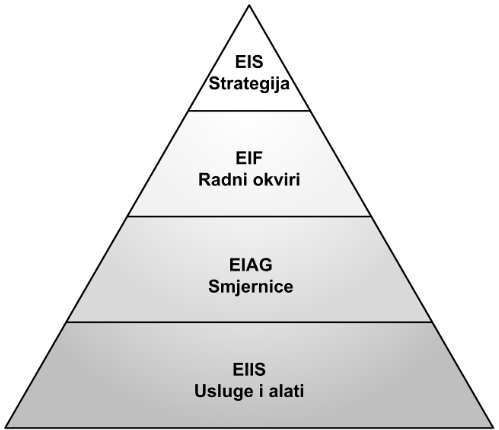
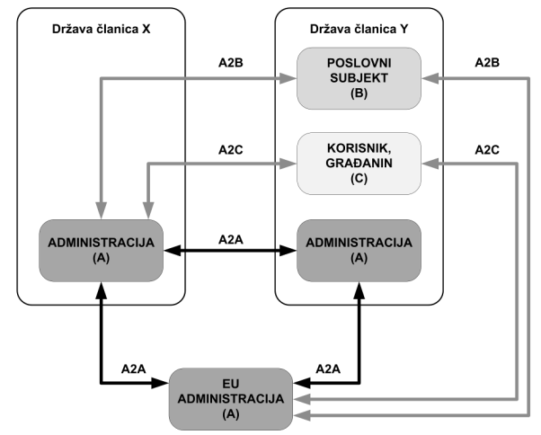

## I1
1. Navedite barem četiri vanjskih čimbenika interoperabilnosti. (2 boda)
  - Vanski cimbenici su razlog postojanja organizacije
    - kontekst djelovanja organizacije u okruženju -> druge organizacije, okolina i subjekti u okruženju s kojima je organizacija u nekom izravnom odnosu 
  - Neposredni vanjski čimbenici su prvi potencijalni subjekti interoperatibilnosti
    - vlasnik ili nadsustav -> zajednici interesi
    - korisnik -> usluga
    - pružatelj usluge -> usluga
    - zajednica -> uvijeti
2. Na što se odnosi konceptualna razina interoperabilnosti? (2 boda)
  - sudionici u komunikaciji u potpunosti razumiju funkcioniranje druge strane, 
  implementacija moze biti razlicita
3. Nacrtati trokut upravljanja interoperabilnošću. (2 boda)



4. Što uključuje struktura HROI-a? (2 boda)
  - struktura HROI-a ukljucuje dokumente vlade rh, sustav upravljanja, 
  organizacije i podrske provedbe, biblioteku strateskih i provedbenih dokumenata 
  interoperatibilnosti, zajednicke resurse i potporne usluge podrske provedbi te provedbene 
  mjere

5. Nacrtajte scenarij interakcije europskih javnih usluga. (2 boda)




Dotatno:
1. unutranji čimbenici interoperabilnosti
2. razine interoperatibilnosti

## I2
### Zadatak 1 (7 bodova)
Napraviti validaciju pomoću XSD (XML Scheme) automobil.xsd prema
sljedećim pravilima:
1. ugraditi u validaciju prema XSD uz atribute `<xs:schema xmlns:xs="http://www.w3.org/2001/XMLSchema">`
2. element automobil je kompleksni tip
3. element proizvodnja je kompleksni tip sa točno jednim elementom
drzava i jednim elementom datum
4. element drzava je jednostavni tip sa enumeracijom: Njemacka,
Francuska, USA
5. element datum je tipa date
6. element marka je tipa string sa atributom skracenica koji je skracenica
od marke vozila
7. element motor je kompleksni tip
8. element potrosnja je tipa integer koji je između 4 i 10, također ima
atribut jedinica koja tipa string

```xml
<?xml version="1.0" encoding="utf-8"?>
<xs:schema xmlns:xs="http://www.w3.org/2001/XMLSchema">

  <xs:simpleType name="drzavaType">
    <xs:restriction base="xs:string">
      <xs:enumeration value="Njemacka"></xs:enumeration>
      <xs:enumeration value="Francuska"></xs:enumeration>
      <xs:enumeration value="USA"></xs:enumeration>
    </xs:restriction>
  </xs:simpleType>
  
  <xs:complexType name="proizvodnjaType">
    <xs:sequence minOccurs="1" maxOccurs="1">
      <xs:element name="drzava" type="drzavaType"></xs:element>
      <xs:element name="datum" type="xs:date"></xs:element>
    </xs:sequence>
  </xs:complexType>

  <xs:complexType name="markaType">
    <xs:simpleContent>
      <xs:extension base="xs:string">
        <xs:attribute name="skracenica" type="xs:string" use="required"></xs:attribute>
      </xs:extension>
    </xs:simpleContent>
  </xs:complexType>

  <xs:simpleType name="potrosnjaType">
    <xs:restriction base="xs:integer">
      <xs:minInclusive value="4"></xs:minInclusive>
      <xs:maxInclusive value="10"></xs:maxInclusive>
    </xs:restriction>
  </xs:simpleType>

  <xs:complexType name="jedinicaType">
    <xs:simpleContent>
      <xs:extension base="potrosnjaType">
        <xs:attribute name="jedinica" type="xs:string" use="required"></xs:attribute>
      </xs:extension>
    </xs:simpleContent>
  </xs:complexType>

  <xs:complexType name="motorType">
    <xs:sequence minOccurs="1" maxOccurs="1">
      <xs:element name="potrosnja" type="jedinicaType"></xs:element>
    </xs:sequence>
  </xs:complexType>

  <xs:element name="automobil">
    <xs:complexType>
      <xs:sequence minOccurs="1" maxOccurs="1">
        <xs:element name="proizvodnja" type="proizvodnjaType"></xs:element>
        <xs:element name="marka" type="markaType"></xs:element>
        <xs:element name="motor" type="motorType"></xs:element>
      </xs:sequence>
    </xs:complexType>
  </xs:element>
  
</xs:schema>

```

### Zadatak 2 (3 boda)
Napraviti validni zapis automobil2.xml prema pravilima iz zadatka 1. sa
proizvoljnim vrijednostima.

```xml
<?xml version="1.0" encoding="utf-8"?>
<automobil>
  <proizvodnja>
    <drzava>Njemacka</drzava>
    <datum>2020-01-15</datum>
  </proizvodnja>
  <marka skracenica="Audi">Audi</marka>
  <motor>
    <potrosnja jedinica="litara">5</potrosnja>
  </motor>
</automobil>
```


## I3
1. Objasniti razliku između sigurnih i nesigurnih metoda kod HTTP
protokola? (2 boda)
  - sigurne metode ne mijenjaju stanje posluzitelja, sluze iskljucivo za dohvat podataka,
  to su metode GET, HEAD, OPTIONS i TRACE
  - nesigune metode su namjenjene izvodenju odredenih akcija n aposluzitelju
  sto znaci da mjenjaju stanje posluzitelja, najcesce promjenom podataka u nekom obliku
  transakcije. To su metode POST, PUT i DELETE
2. Što označava HTTP statusni kod 401? (2 boda)
  - statusni kod 401 oznacava unauthorized, tj. neautorizirani pristup
3. Što sve sadrži aplikacijski sloj troslojnog modela? (2 boda)
  - aplikacijski sloj troslojnog modela sadrzi poslovnu logiku odnosno poslovne procese, 
  prima podatke i akcije iz prezentacijskog sloja, dohvaca podatke iz podatkovnog sloja,
  obraduje ih te ih vraca za prezentaciju korisniku i u podatkovni sloj kao posljedicu obrade
4. Koji scenarij interoperabilnosti različitih slojeva je najčešći, a koji
najrjeđi i zašto? (2 boda)
  - interoperatibilnost prezentacijskog i poslovnog sloja je najčešći scenarij 
  interoperatibilnosti razlicitih slojeva jer odvajamo dvije domene kako bi sustav bio sto 
  fleksibilniji te mozemo koristiti razlicite tehnologije za prezentaciju i poslovni sloj
  - interoperatibilnost dvaju prezentacijskih slojeva nije ni cesto ni popularno rjesenje
  zbog problema sessiona i stanja aplikacije
5. Na što se odnosi „bridging“ tehnologija izvedbe interoperabilnosti? (2 boda)
  - na medusobne pozive klasa npr. u tehnologijama Java i .NET koje se izvode u JVM-u i
  CLR-u putem "mosta"


Dodatno:
1. Ostali statusni kodovi
2. Sadrzaj slojeva troslojnog modela
3. Scenariji interoperabilnosti različitih slojeva
4. Tehnologije izvedbe interoperabilnosti

## I4
1. Navedite i opišite korake u korištenju usluga weba. (3 boda)
  - prvi korak je medusobno otkrivanje sudionika u procesu
  - usuglasavanje nacina komunikacije medu agentimazahtjevatelja i pruzatelja usluge
  - usuglasene uvjete programski ugraditi u svaki od agenata
  - agenti mogu poceti medusobno izmjenjivati poruke
2. Navesti i opisati što sve sadrži tijelo SOAP poruke. (1 BOD)
  - tijelo soap poruke sadrzi samu poruku i opcionalno pogresku koja se mogla dogoditi tijekom 
  prijenosa ili obrade informacije
3. Koje dijelove usluge WSDL ne opisuje? (2 boda)
  - Informacije poslužitelja
  - Sigurnosne informacije
4. Što opisuje WSDL element „binding“? (2 boda)
  - element biding je konkretan nacin izvedbe usluge, definira protokol koji se koristi za 
  slanje te nacin koristenja i izgled poruke SOAP
5. Što uključuje specifikacija WS-Policy zajedno s WS-PolicyAssertion i WS-
PolicyAttachments? (2 boda)
  - ukljucuje skup vlastitih poslovnih pravila, sigurnosnih politika i ostalih
  propisanih postupaka objedinjeni u jedinstvenom skupu politika


Dodatno:
1. Sadrzaj soap poruke
2. Koje djelove usluge opisuje WSDL
3. Elementi WSDL-a
4. Suluge weba 2.0

## I5

U datoteci „PetiIshod.zip“ nalazi se solution „Zadatak“ i „AlgebraAPI“ mapa. U
„AlgebraAPI“ mapi postoji API.exe koji će pokretanjem stvoriti endpoint na
http://localhost:5000.

### Zadatak 1 (2 boda)
Kreirati klasu Predmet koji sadrži svojstvo „naziv“ tipa String, svojstvo „smjer“
tipa String, svojstvo „brojEctsbodova“ tipa int i „prosjekOcjena“ tipa double.
Kreirati nekoliko auta spremite ih u listu i na endpointu „/api/predmet“
pozivom HTTP metode GET ispišite listu stvorenih predmeta.

### Zadatak 2 (3 boda)
Kreirati endpoint na koji je potrebno poslati proizvoljnu godinu npr.
„/api/predmet/IIS“ koji pozivom metode GET ispisuje listu stvorenih
predmeta koji imaju broj ECTS bodova veću ili jednaku od poslane vrijednosti.
(npr. svi predmeti koji imaju broj ECTS bodova veću ili jednaku 5)

### Zadatak 3 (2 boda)
Kreirati HTML stranicu koja poziva akciju „/api/predmet“ s POST metodom,
koja šalje naziv, smjer, broj ECTS bodova i prosjek. Poslati proizvoljni odgovor
na „submit“ te forme.

### Zadatak 4 (3 boda)
Kreirati endpoint „/api/predmet“ kada se zove metodom POST da spremi
novi objekt tipa „Predmet“ u listu predmeta. Testirati poziv na ovaj endpoint
HTML formom iz zadatka 3.

### Zadatak 5 (3 boda)
Dovršiti Algebra.cs u mapi „api“ i spremiti dohvat sa http://localhost:5000 u
objekt unutar programskog koda. Kreirati endpoint koji šalje broj ECTS bodova
prema kojem se određuje koliko prosječno sati se mora uložiti u učenje
predmeta da bi prosječan student ostvario prosječnu ocjenu (broj ECTS-a
pomnožen s 30), npr. „/api/predmet/IIS“ gdje se pozivom metode GET
dobiva ispis naziva predmeta i broj sati potrebnih za učenje.


## I6
1. Navedite barem pet ciljeva normizacije. (3 boda)
2. Objasnite fazu javne rasprave kod donošenja norme u RH. (2 boda)
3. Što je to ebXML? (2 boda)
4. Skicirajte tehnološku arhitekturu e-Računa. (3 boda)
5. Objasnite strukturu UTF-8 kao vrste kodiranja. (2 boda)


## I7
1. Nabrojite barem pet zahtjeva nad sigurnošću. (2 boda)
2. Navedite osnovne razlike između kriptografskih algoritama s
asimetričnim i simetričnim ključem. (2 boda)
3. Što je to kvalificirani certifikat? (2 boda)
4. Za koji od navedenih modela kriptoanalitičkih napada vrijedi da se koristi
napad grubom silom koji ne koristi sve moguće ključeve, već isprobava
samo određeni skup ključeva? (2 boda)
  * Napad poznatim izvornim tekstom
  * Napad pogađanjem ključeva ili lozinki grubom silom
  * Napad rječnikom
  * Napad poznatim kriptiranim tekstom
  * Napad odabranim izvornim tekstom
  * Napad odabranim kriptiranim tekstom
5. Što je to SAML? (2 boda)
