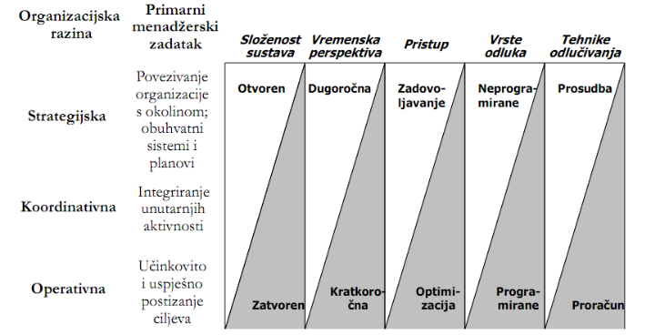
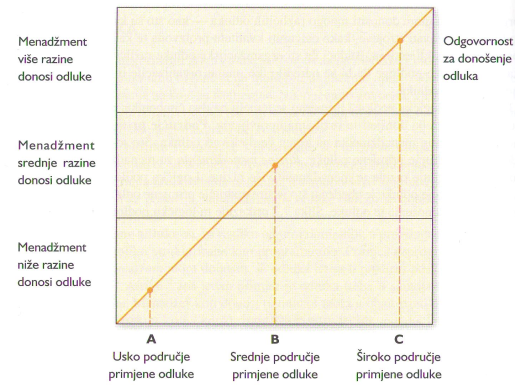
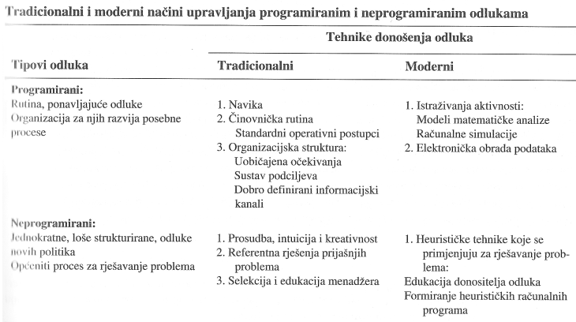
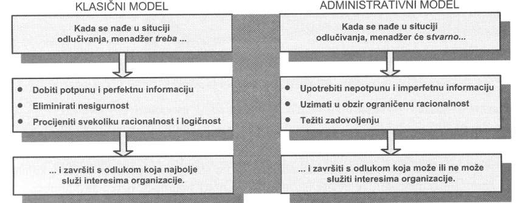
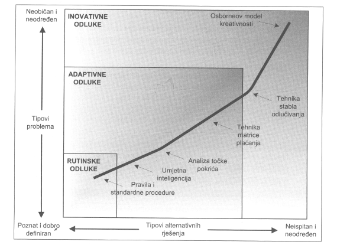
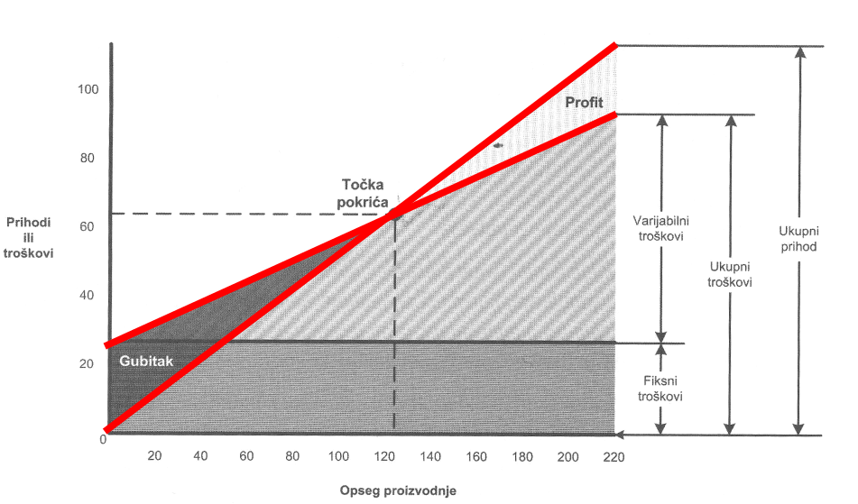
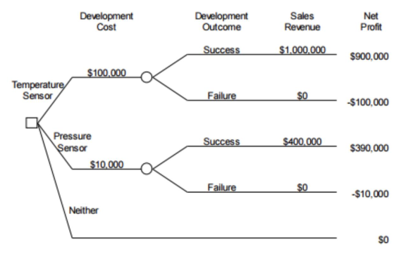
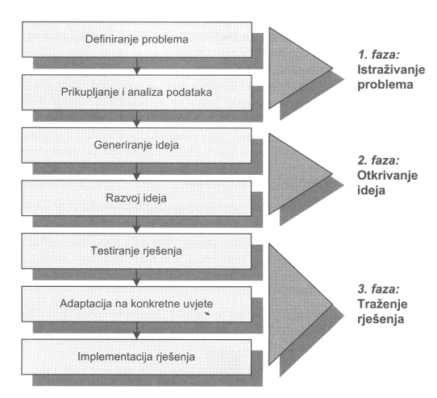

# I4 - Odlučivanje

Dva bitna aspekta u definiraju odlucivanja:
1. **procesni aspekt** - odluivanje se definira kao proces identifikacije 
problema i mogucnosti njihova rjesavanja.
2. **aspekt stanja** - odlucvanje se definira kao cin izbora jedne od nekoliko 
potencijalnih mogucnosti.

Odlucivanje je kreativni proces koji se ostvaruje racionalno uz 3 pretpostavke:
1. postoji jasno razumijevanje alternativnih pravaca putem kojih se mogu ostvariti
postavljeni ciljevi uz postojece prilike i ogranicenja
2. postoje informacije i sposobnosti donositelja odluka za analizu i evaluaciju
alternativa u okviru postavljenih ciljeva
3. postoji zelja donositelja odluka za iznalazenje najbolje alternativne solucije
koja mora biti efikasna za ostvarenje postavljenih ciljeva

Razine menadžmenta i odlučivanje

Odluke i tipovi odluka

Odluka je rezultat procesa odlucivanja. Drucker razlikuje 3 vrste odluka:
1. strateske
2. takticke
3. rutinske

Druckerova podjela odluka suglasna je konceptu razina planiranja, što
znači da se na strateškoj razini planiranja donose strateške, na 
taktičkoj taktičke, a na operativnoj razini rutinske odluke.

Hellriegel i Slocum razlikuju
1. rutisnke
2. adaptivne
3. inovativne odluke

Hellriegelova i Slocumova podjela odluka više je orijentirana
karakteru problema s aspekta stupnja spoznaje; što je problem više
poznat, odluka će imati rutinski karakter, dok će nizak stupanj
spoznaje problema zahtijevati inovativne odluke.

Postoji i klasifikacija koja odluke svrstava u:
1. programirane - odnose se na poznate probleme s unaprijed odredenim 
nacinom rjesavanja (rutinske)
2. neprogramirane - odnose se na nepoznate probleme, a u krajnjem slucaju
nije ni poznat nacin njihovog rjesavanja (inovativne)

Tradicionalni i moderni nacini upravljanja programiranim i ne programiranim odlukama

Hellriegel i Slocum smatraju da postoje 4 preduvjeta donošenju odluka:
1. postojanje nesklada izmedu stanja i cilja
2. svijest donositelja odluka o znacenju tog nesklada
3. motiviranost donositelja odluka da djeluje na taj nesklad
4. raspolaanje donositelja odluka adekvatnim resursim akojima bi mogao 
djelovati na uklanjanje tog nesklada

Uvjete u kojima treba djelovati moze karakterizirati:
1. sigurnost - pretpostavka da se tocno mogu predvijeti rezultati svake
od alternativa za rjesenje problema (rutinske odluke)
2. rizik - tip odlucivanja u uvijetima gdje rezulati nisu sigurni,
vec su poznate vjerojatnosi za razlicite rezultate (strateske odluke)
3. nesigurnost - tip odlucivanja koji se zbiva u uvijetima nedostatka
adekvatnih informacija

Dva najvaznija modela donosneja odluka:
1. klasicni model - normativni, govori kako treba donositi odluke, pomaze u racionalnosti
2. administrativni model - ako se zaista donose odluke

Tri karakteristicne faze u procesu donosenja odluke:
1. generiranje alternativnih rjesenja (izrazivanje mogucnosti ostvarivanja postavljenih ciljeva)
2. evaluiranje alternativnih rjesenja (evaluacija generiranih alternativa s aspekta doprinosa ostvarenju postavljenih ciljeva)
3. selekcija alternativnog rjesenja (selekcija prikladne alternative)

Tehnike generiranje alternativnih rjesenja:
* brainstorming (generiranje sto veceg broja rjesenja)
* morfoloska analiza (rascljanjivanje problema, generiranje parcijalnih rjesenja, analiza i izbor rjesenja)
* sinektika (generiranje jednog rjesenja koje ukljucuje razlicite ekspertize)

Evaluiranje alternativnih rjesenja
1. alternative odredene kvantitativnim faktorima - provodi se na temelju
mjerljivih numerickih izraza
2. alternative odredene kvalitativnim faktorima - radi se o nemjerljivim
atributivnim izrazima

Metode evaluacije
1. marginalna analiza - analiziraju se odnosi ukupnih, prosjecnih i 
granicnih velicina (korisnost dobara, prihodi i troskovi poduzeca itd) kako 
bi se doslo do optimalnog obujma prozivodnje, optimalne razine cijena, 
optimalnih pridoda i troskova itd.
2. cost-effectivnes analiza - unaprijedenje marginalne analize na podrucjima
na kojima treba ocjenjivati prihvatljivost neke alternative i s aspekta 
kvantitativnih faktora, nastoji pronaci najbolji omjer izmedu troskova i koristi. trazi optimalno rjesenje za ostvarenje postavljenog cilja

Tri vrste alternativnog rjesenja prema Ackoffu
1. zadovoljavajuce - nekvantitativne, subjektivne metode
2. optimalno - sistematsko istrazivanje alternativnih rjesenja znanstvenim
promatranjem i kvantitativnim mjerenjem
3. idealno - kombinirane nekvantitativne i kvantitativne metode

Selekcija alternativnog rjesenja
1. iskustvom
2. eksperimentom
3. istrazivanje i analiza (najefikasnija tehnika)

Tri najcesca oblika grupnog odlucivanja:
1. interaktivne grupe - grupa ljudi donosi odluku (tim, odjel, odbor)
2. nominalne grupe - clanovi grupe individualno generiraju ideje, slijedi prezentacija i nadopuna te evaluacija
3. delfi grupe - sofisticirana tehnika za rjesavanje slozenih i nestrukturiranih problema, provodi se kroz upitnike

Tehnike donošenja odluka sa stajališta Hellriegela i S. Locuma

Za donosenje rutinskih odluka (poznati i dobro definirani problemi) koriste se:
* pravila i standardne procedure
* umjetna inteligencija

Za donosenje adaptivnih odluka (umjereno neodredeni problemi i alternativna rjesenja) koriste se:
* analiza kriticne tocke
* matrica isplativnosti

Za donosenje inovativnih odluka (neobicni i neodredeni problemi) koriste se:
* tehnika stabla odlucivanja
* Osborneov model kreativnosti

Analiza točke pokrića (break even point analysis) pokazuje odnose izmedu
obujma proizvodnje, prihoda, troskova i profita za poduzece ili
proizvodnu liniju. Cilj je utvrditi ondose izmedu troskova i profita.
Upotrebljava se u projiciranju profita, kontroli troskova, odredivanju 
cijena te kao pomoc menadzmentu u odabiru alternativnih rjesenja.

Matrica plaćanja/isplativosti (pay-off matrix) je tehnika odlucivanja koja 
se primarno koristi u slucaju rizika. To je nacin prikaza poslijedica
izbora neke alternative (odluke) ovisno o situaciji. Poslijedice odlucivanja
se izrazavaju u ulaganjima, dobiti, troskovima i sl.

Stablo odlučivanja je posebna tehnika donosenja odluka koja se temelji na
odnosima izmedu strategije i stanja. Rabi se za kompleksnne probleme 
financiranja, marketinga, izgradnje tvornice, uvodenje novih proizovda itd.

Osborneov model kreativnosti oznacuje posebnu tehniku koja se rabi u procesu
donosenja inovativnih odluka. Sastoji se od tri osnovne faze:
1. istrazivanje problema - definiranje problema, prikupljanje podataka i provodenje analize kako bi se otkrili svi bitni aspekti problema
2. otkrivanje ideja - prikupljanje ideja
3. trazenje rjesenja - odabir najbolje ideje, adaptacija iste na konkretne uvijete te implementacija rjesenja

## Zadatak
Ana je voditelj poslovnice jedne velike banke. Poslovnica se nalazi u jednom malom mjestu s oko 4.000
stanovnika, uglavnom starije životne dobi koji su navikli dolaziti u poslovnicu i minimalno koriste
suvremene tehnološke mogućnosti (e-bankarstvo, bankomate i sl.). Oni također imaju niska primanja,
pa poslovnica nema potencijala za različite financijske proizvode (poput mirovinske štednje,
financijskih fondova i sl.). Dobra je stvar da je poslovanje stabilno, no zbog navika klijenata u poslovnici
je skoro uvijek gužva. Ana bi voljela imati više zaposlenih, ali zbog malog financijskog potencijala
centrala ne odobrava dodatne zaposlenike.

Zbog takve situacije Ana većinu svojeg vremena ulaže u organiziranje posla i motiviranje zaposlenika,
iako je odgovorna i za dvadesetak velikih klijenata iz svoje poslovnice s kojima mora aktivno raditi i s
kojima ostvaruju veliki dio poslovanja. To su uglavnom mala i srednja poduzeća te nekoliko fizičkih
osoba koje imaju velike prihode i značajna sredstva te koriste brojne bankarske proizvode. Njima se
treba uvijek biti na raspolaganju te im je važno ponuditi kvalitetne savjete. Kako bi u vrijeme kada se
obično događa najveća gužva (ujutro i predvečer) osigurala koliko-toliko normalno poslovanje u
poslovnici, mora pažljivo promišljati i definirati raspored rada. Pri tome jako vodi računa o zadovoljstvu
svojih zaposlenika te puno vremena provodi razgovarajući s njima, rješavajući potencijalne konflikte,
motivirajući ih i slično. To ponekad zna biti vrlo iscrpljujuće, iako općenito gledano Ana ima zaista
odličan tim i njihovi su odnosi vrlo dobri.

Jučer je Ana iz centrale dobila dopis u kojem se od nje traži da u sljedećih godinu dana ostvari dva cilja:
1. Poveća zadovoljstvo zaposlenika
2. Poveća zadovoljstvo klijenata

Vezano za prvi cilj, iz centrale je dobila rezultate istraživanja zadovoljstva poslom svojih zaposlenika.
Općenito, zaposlenici imaju dosta visoko zadovoljstvo poslom, no najviše su zadovoljni odnosima s
nadređenim i suradnicima, dok su najmanje zadovoljni radnim uvjetima i mogućnošću da napreduju.
Za zadovoljstvo klijenata nije provedeno istraživanje i Ana mora sama isplanirati do kraja realizaciju tog
cilja. Ona sada mora odlučiti što će, i kako učiniti po pitanju realizacije tih ciljeva.
Za ostvarivanje tih ciljeva Ani nije još dodijeljen nikakav budžet, već se od nje očekuje da predloži
određena rješenja i plan realizacije tih rješenja. Ako prijedlozi budu dobro osmišljeni i isplanirani,
sredstva će biti odobrena. To će i za Anu imati pozitivan efekt, jer će se pokazati sposobnom donositi i
složenije odluke od onih koje su predmet svakodnevnog poslovanja i vođenja poslovnice.

### Pitanja
1. Navedite jedan od preduvjeta donošenja odluka koji je opisan u ovom primjeru. (3 boda)
  * Moguće je više odgovora, jer je zadovoljeno tri od četiri preduvjeta:
    1. Postojanje nesklada između stanja i cilja – trenutno stanje zadovoljstva zaposlenika i klijenata je manje od stanja kakvo se treba ostvariti za godinu dana
    2. Svijest donositelja odluka o značenju tog nesklada – Ana, koja treba donijeti odluku o tome kako nesklad eliminirati, svjesna je da postoji razlika između trenutnog i željenog stanja.
    3. Motiviranost donositelja odluka da djeluje na taj nesklad – Ana je motivirana djelovanjem na nesklad, jer joj je tako naloženo iz uprave. U ovom slučaju radi se o vanjskoj motivaciji, odnosno motivacija nije proizašla iz Anine analize trenutnog stanja, već je „nalog“ došao s viših hijerarhijskih razina.
2. Na temelju kojeg modela donošenja odluka će Ana djelovati – klasičnog ili administrativnog? Obrazložite svoj odgovor? (3 boda)
  * Obzirom da Ana nema sve potrebne informacije i ne djeluje u uvjetima potpune sigurnosti, ona će djelovati na temelju administrativnog modela. Administrativni model, osim gore navedenih uvjeta, također pretpostavlja da je traženje alternativa ograničeno zbog ograničenosti resursa. U ovom primjeru, ograničeni su ljudski i financijski resursi.
3. Koju biste, i zašto, tehniku generiranja alternativnih rješenja preporučili Ani? Zbog čega biste predloženu metodu preferirali u odnosu na preostale dvije? (3 boda)
  * Svakako je najprikladnija metoda brainstorminga, jer je cilj generirati što više mogućih rješenja koja će se kasnije analizirati prema određenim kriterijima. Također, Ana nema na raspolaganju stručnjake, niti puno vremena da bi mogla koristiti morfološku metodu ili sinektiku.
4. Koju tehniku donošenja odluke o izboru najboljeg rješenja smatrate prikladnom za ovu situaciju? Obrazložite svoj odgovor. (3 boda)
  * Kako se radi o adaptivnoj odluci, mogu se koristiti tehnike analize točke pokrića ili tehnika matrice plaćanja (ili isplativosti). Prema toj tehnici, Ana će za svaku alternativu, odnosno odluku koju je generirala za ostvarivanje svojih ciljeva, pokušati predvidjeti posljedice te odluke. Na kraju će se odlučiti za onu odluku koja je najisplativija.
5. Prema Hellriegel i Slocumovoj klasifikaciji odluka, o kakvoj se odluci radi? Obrazložite odgovor navodeći činjenice iz primjera. (2 boda)
  * Radi se o adaptivnoj odluci, jer se radi o problemu koji nije potpuno nepoznat, a opet se ne može reći da se radi o rutinskom odlučivanju. Naime, odluka o tome kako povećati zadovoljstvo zaposlenika i klijenata svaki puta mora krenuti od početnog, trenutnog zadovoljstva. Kako se trenutno zadovoljstvo mijenja, tako se i odluke o tome kako zadovoljstvo povećati razlikuju, ali ne u tolikoj mjeri da bismo mogli reći da se radi o inovativnim odlukama.
6. Radi li se o programiranoj ili neprogramiranoj odluci? Obrazložite odgovor navodeći činjenice iz primjera. (2 boda)
  * Ovdje se radi o neprogramiranoj odluci. Iako je pitanje povećanja zadovoljstva zaposlenika i klijenata relativno poznati problem, ipak se mora osmisliti novi način rješavanja tog problema, što znači da je odluka neprogramirana.
7. U kojim uvjetima se donosi odluka (sigurnost, rizik ili neizvjesnost)? Obrazložite svoj odgovor i potkrijepite ga navodima iz primjera.
8. Koje biste tehnike koristili u fazi evaluacije alternativa? Koje u fazi selekcije alternativa?
9. Može se postaviti konkretno pitanje da li je bolja jedna ili druga tehnika odlučivanja... i sl.